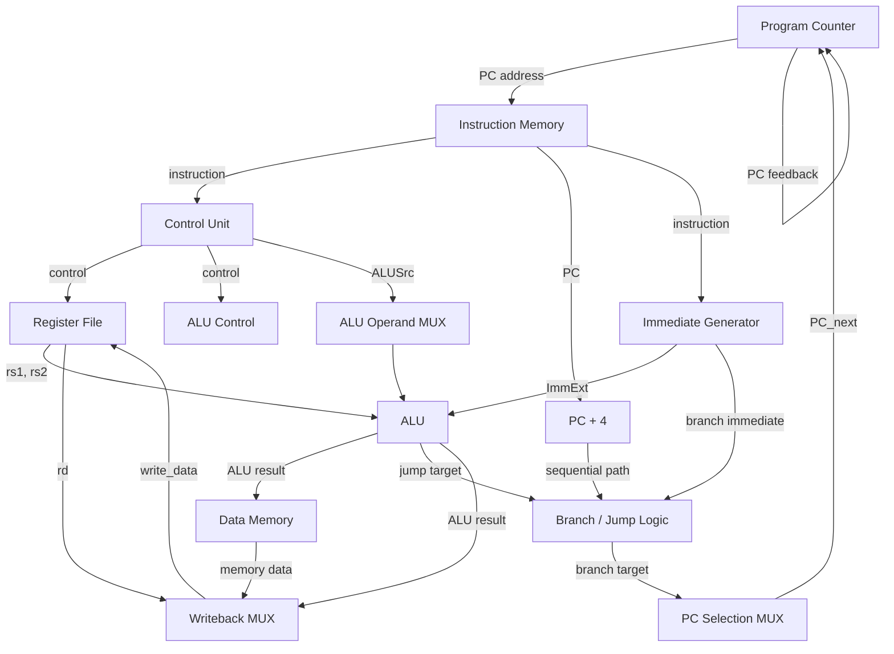
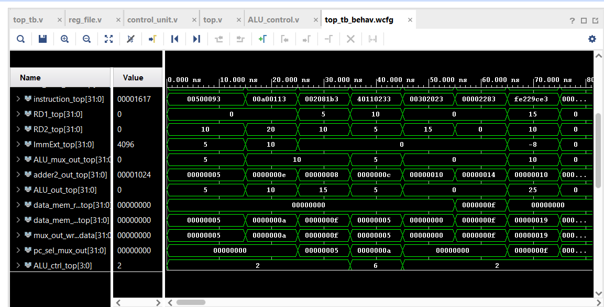

# 32-bit Single-Cycle RISC-V CPU

This repository contains a 32-bit single-cycle RISC-V processor implemented in synthesizable Verilog RTL. The design targets a practical subset of the RV32I integer instruction set and emphasizes the hardware implementation of a CPU datapath: instruction fetch, decode, register access, immediate generation, ALU execution, memory access, control-flow handling, and register writeback.

The project was developed and verified in Vivado using behavioral simulation, waveform analysis, and RTL-level debugging. It is intended as a serious digital hardware design project showcasing datapath and control integration for a processor architecture rather than a generic educational example.

## Table of Contents

- [Project Overview](#project-overview)
- [Objectives](#objectives)
- [ISA Support](#isa-support)
- [Instruction Format / ISA Coverage](#instruction-format--isa-coverage)
- [CPU Architecture](#cpu-architecture)
- [Datapath Diagram](#datapath-diagram)
- [RTL Module Architecture](#rtl-module-architecture)
- [Control Unit](#control-unit)
- [ALU Control](#alu-control)
- [Immediate Generation](#immediate-generation)
- [PC / Control Flow Path](#pc--control-flow-path)
- [JAL / JALR Return Address](#jal--jalr-return-address)
- [Memory Operations](#memory-operations)
- [BEQ Verification](#beq-verification)
- [Verification Methodology](#verification-methodology)
- [Verified Instructions](#verified-instructions)
- [Representative Waveform](#representative-waveform)
- [Elaborated Design](#elaborated-design)
- [Toolchain / Development Flow](#toolchain--development-flow)
- [Design Debugging and Key Fixes](#design-debugging-and-key-fixes)
- [Example Execution Flow](#example-execution-flow)
- [Repository Structure](#repository-structure)
- [Limitations](#limitations)
- [Future Work](#future-work)
- [Why This Project Matters](#why-this-project-matters)
- [Synthesis & FPGA Implementation — Planned](#synthesis--fpga-implementation--planned)
- [Author](#author)

---

## Project Overview

The project is a 32-bit single-cycle RISC-V CPU implemented in Verilog HDL. The processor follows a single-cycle datapath in which each instruction completes its major execution stages within one clock cycle.

The design was developed and simulated using:

- Verilog HDL
- AMD/Xilinx Vivado Design Suite
- Vivado Behavioral Simulation
- Xilinx Artix-7 FPGA target
- Device: xc7a35tftg256-1
- GNU RISC-V toolchain
- WSL/Ubuntu for assembling and generating RISC-V machine-code test programs

This project focuses on understanding how a CPU operates at the RTL level, including:

- program counter generation
- instruction fetching
- instruction decoding
- register-file access
- immediate generation
- ALU operation selection
- arithmetic/logical execution
- load/store memory operations
- conditional branching
- unconditional jumps
- register writeback
- JAL/JALR return-address handling
- RTL simulation and waveform-based verification

The implemented CPU is not a full RV32I general-purpose processor; it is a verified subset of the RV32I integer ISA implemented and validated at the RTL level.

---

## Objectives

1. Design a 32-bit single-cycle RISC-V processor using synthesizable Verilog RTL.
2. Implement a practical subset of the RV32I instruction set.
3. Design the CPU datapath and control unit from individual RTL modules.
4. Implement instruction, register, and data-memory interfaces.
5. Implement immediate generation for multiple RISC-V instruction formats.
6. Implement ALU control using opcode/funct fields.
7. Implement conditional branch and jump mechanisms.
8. Verify individual instructions using Vivado behavioral simulation.
9. Verify control-flow instructions using RTL waveforms.
10. Elaborate the complete RTL design in Vivado and inspect the generated hardware hierarchy.

---

## ISA Support

This design implements a verified RV32I instruction subset. The current implementation supports the instructions listed below and has been checked by behavioral simulation and waveform inspection.

| Category | Instructions | Status |
| --- | --- | --- |
| R-Type | ADD, SUB, AND, OR | Verified |
| I-Type | ADDI | Verified |
| Load/Store | LW, SW | Verified |
| Branch | BEQ | Verified |
| U-Type | LUI, AUIPC | Verified |
| Jump | JAL, JALR | Verified |

The current project is best described as a Verified RV32I instruction subset rather than a complete RV32I implementation. The design is intentionally scoped to the instructions implemented and tested in this repository and can be extended toward the complete RV32I base ISA in future work.

The following instructions are not claimed as implemented in this revision:

- BNE
- BLT
- BGE
- SLT
- SLTI
- shifts
- byte/halfword loads/stores
- other unverified RV32I instructions

---

## Instruction Format / ISA Coverage

The implementation covers multiple RISC-V instruction formats used in the current datapath and control logic:

- R-type
- I-type
- S-type
- B-type
- U-type
- J-type

| Instruction | Format | Main datapath operation |
| --- | --- | --- |
| ADD | R | Register + Register |
| SUB | R | Register - Register |
| AND | R | Bitwise AND |
| OR | R | Bitwise OR |
| ADDI | I | Register + Immediate |
| LW | I | Address calculation + memory read |
| SW | S | Address calculation + memory write |
| BEQ | B | Register comparison + PC-relative branch |
| LUI | U | Upper immediate writeback |
| AUIPC | U | PC + upper immediate |
| JAL | J | PC-relative jump + PC+4 writeback |
| JALR | I | Register-relative jump + PC+4 writeback |

---

## CPU Architecture

The processor is a classic single-cycle CPU datapath. Each instruction performs the major execution steps in one clock cycle: fetch, decode, register read, ALU operation, memory access (if needed), and writeback.

The major RTL blocks are:

- Program Counter
- PC + 4 incrementer
- Instruction Memory
- Control Unit
- Register File
- Immediate Generator
- ALU Control
- ALU
- Branch Adder
- Branch Gate Logic
- Data Memory
- Multiplexers
- Writeback path
- JAL/JALR PC selection
- JAL/JALR return-address writeback

The instruction flow is:

PC
→ Instruction Memory
→ Instruction Decode / Control
→ Register File + Immediate Generator
→ ALU
→ Data Memory / Branch / Jump logic
→ Writeback
→ Register File

The PC update path supports the following sources:

- PC + 4 for sequential execution
- PC + branch immediate for BEQ
- PC + JAL immediate for JAL
- rs1 + immediate for JALR

---

## Datapath Diagram

The following Mermaid diagram captures the architecture of the implemented single-cycle datapath, including the PC feedback path and branch/jump selection logic.



This block-level view shows the same hardware structure seen in the design: the PC fetches instructions, the control unit decodes them, the register file and immediate generator feed operands into the ALU, and branch/jump logic modifies the next PC value before the next fetch cycle.

---

## RTL Module Architecture

The processor is assembled from the following RTL modules present in the repository:

| Module | Purpose | Inputs | Outputs | Role in datapath |
| --- | --- | --- | --- | --- |
| `program_counter.v` | Stores the current 32-bit PC | `clk`, `rst`, `PC_in` | `PC_out` | Drives the instruction fetch address |
| `PC_inc.v` | Generates `PC + 4` | `fromPC` | `toPC` | Sequential PC path |
| `mux.v` | Generic 32-bit 2:1 multiplexer | `sel`, `A`, `B` | `mux_out` | Used for ALU operands, PC selection, and writeback paths |
| `instruction_mem.v` | 32-bit instruction memory | `clk`, `rst`, `read_address` | `instruction_out` | Fetches instruction words from PC-derived addresses |
| `reg_file.v` | 32 general-purpose registers | `clk`, `rst`, `reg_write`, `rs1`, `rs2`, `rd`, `write_data` | `read_data_1`, `read_data_2` | Source and destination operands |
| `control_unit.v` | Decodes opcode and drives control signals | `opcode` | `ALUSrc`, `MemtoReg`, `RegWrite`, `MemRead`, `MemWrite`, `Branch`, `LUI_en`, `AUIPC_en`, `JAL_en`, `JALr_en`, `ALUop` | Main control logic |
| `imm_gen.v` | Generates immediates for different instruction formats | `opcode`, `instruction` | `ImmExt` | Sign-extends and aligns immediate values |
| `ALU_control.v` | Maps ALUOp plus funct fields to ALU function | `ALUOp`, `func7`, `func3` | `control_out` | Selects ADD/SUB/AND/OR behavior |
| `ALU_unit.v` | Arithmetic/logical datapath | `A`, `B`, `control_in` | `zero`, `ALU_out` | Executes arithmetic and comparison operations |
| `branch_adder.v` | Branch target computation | `plus4_addr`, `ImmAddr` | `mux_in_adder` | Calculates `PC + branch immediate` |
| `gate_logic.v` | Branch condition gate | `Branch`, `zero` | `and_out` | Produces branch-taken signal |
| `data_mem.v` | Data memory for loads and stores | `clk`, `rst`, `MemRead`, `MemWrite`, `address`, `write_data` | `read_data` | Implements load/store access |
| `top.v` | Full CPU integration | `clk`, `rst` | internal datapath | Connects all modules and handles PC/update multiplexing |

### Module notes

#### `program_counter.v`

The program counter stores the current 32-bit PC value and updates on the active clock edge. It includes reset behavior and receives the next PC value through `PC_in`.

#### `PC_inc.v`

This module generates `PC + 4`, which is used for sequential execution and as the return-address value for JAL/JALR.

#### `mux.v`

`mux.v` is a generic 32-bit 2:1 multiplexer used throughout the datapath for ALU operands, PC selection, and writeback selection.

#### `instruction_mem.v`

This module implements a 32-bit instruction memory addressed from the PC. In the current simulation setup, instruction memory locations are indexed based on the instruction address, and the CPU fetches each instruction word from memory.

#### `reg_file.v`

The register file contains 32 general-purpose 32-bit registers with two asynchronous read ports and one synchronous write port. Reset initialization is implemented, and x2/sp is initialized to 64 in the current implementation. x0 remains the zero register as used by RISC-V programs.

#### `control_unit.v`

The control unit decodes the 7-bit opcode and generates the main control signals for the datapath, including:

- `ALUSrc`
- `MemtoReg`
- `RegWrite`
- `MemRead`
- `MemWrite`
- `Branch`
- `LUI_en`
- `AUIPC_en`
- `JAL_en`
- `JALr_en`
- `ALUop`

#### `imm_gen.v`

The immediate generator produces the sign-extended or appropriately placed immediate values for:

- I-type
- S-type
- B-type
- U-type
- J-type

It is a key datapath block because each instruction format encodes immediates in different bit positions.

#### `ALU_control.v`

The ALU control block combines `ALUOp`, `funct7`, and `funct3` to select the arithmetic or logical operation executed by the ALU. The current implementation includes ADD, SUB, AND, and OR support. BEQ uses subtraction/equality detection because the zero flag from the ALU indicates equality.

#### `ALU_unit.v`

The ALU executes arithmetic and logical operations and generates a zero flag. This zero output is used by BEQ comparisons; when the ALU subtracts two operands and the result is zero, the branch condition is satisfied.

#### `branch_adder.v`

This module computes the PC-relative branch target based on `PC + immediate`.

#### `gate_logic.v`

`gate_logic.v` produces the branch-taken condition as `Branch AND zero`, which is used to decide whether the branch target is selected as the next PC.

#### `data_mem.v`

The data memory supports synchronous writes and readback for load/store operations. It is used to implement `LW` and `SW` in the current datapath.

#### `top.v`

`top.v` integrates the entire CPU datapath, connects all modules, and implements the complete PC selection, control, and writeback path used during execution.

---

## Control Unit

The control unit decodes the instruction opcode and generates the control signals necessary to steer the datapath. The main control signals are:

| Signal | Purpose |
| --- | --- |
| `ALUSrc` | Selects ALU operand source between register data and immediate |
| `MemtoReg` | Selects memory data vs. ALU result for writeback |
| `RegWrite` | Enables register writeback |
| `MemRead` | Enables load data read from memory |
| `MemWrite` | Enables data-memory write |
| `Branch` | Indicates a branch instruction is active |
| `LUI_en` | Enables upper-immediate writeback path |
| `AUIPC_en` | Enables `PC + upper immediate` path |
| `JAL_en` | Selects JAL operation and PC-relative jump target |
| `JALr_en` | Selects JALR operation and register-relative jump target |
| `ALUOp` | Selects the ALU control mode |

### Control behavior for the implemented subset

| Instruction | Control behavior |
| --- | --- |
| R-type | `ALUSrc = 0`, `RegWrite = 1`, `ALUOp = 10` |
| ADDI | `ALUSrc = 1`, `RegWrite = 1`, immediate used in ALU |
| LW | `ALUSrc = 1`, `MemRead = 1`, `MemtoReg = 1`, `RegWrite = 1` |
| SW | `ALUSrc = 1`, `MemWrite = 1` |
| BEQ | `Branch = 1`, ALU performs subtraction, zero flag is checked |
| LUI | `LUI_en = 1`, immediate value is written back to rd |
| AUIPC | `AUIPC_en = 1`, `PC + immediate` written back to rd |
| JAL | `JAL_en = 1`, `RegWrite = 1`, PC-relative target and return address calculation |
| JALR | `JALr_en = 1`, `RegWrite = 1`, rs1 + immediate target |

The implementation uses the actual control values present in the RTL and avoids inventing unsupported signals or unimplemented instruction behaviors.

---

## ALU Control

The ALU uses a two-level control mechanism:

Instruction opcode
→ Main Control Unit
→ `ALUOp`
→ ALU Control
→ ALU function

The current ALU operations implemented in the design are:

- ADD
- SUB
- AND
- OR

The control block is implemented in `ALU_control.v`, which interprets `ALUOp`, `funct7`, and `funct3` to select the correct ALU operation.

For `BEQ`, the control path selects branch-comparison mode. The ALU performs subtraction and drives the `zero` flag. When the subtraction result is zero, the branch-decision logic asserts the branch condition.

The branch condition is computed as:

`Branch AND zero`

This means that a branch instruction only redirects the PC when both the instruction is a branch and the comparison result is equal.

---

## Immediate Generation

The immediate generator supports the instruction formats implemented in this CPU. It generates either sign-extended values or appropriately shifted immediate constants depending on the opcode.

### I-type

`instruction[31:20]` is used for immediate extraction. This is used for instructions such as `ADDI` and `LW`.

### S-type

The store immediate is assembled from:

`instruction[31:25] + instruction[11:7]`

This is used for `SW`.

### B-type

The branch immediate uses the standard RISC-V encoding:

`instruction[31], instruction[7], instruction[30:25], instruction[11:8], 0`

with sign extension applied as required.

### U-type

For `LUI` and `AUIPC`, the immediate is formed from:

`instruction[31:12] << 12`

which is equivalent to taking the upper 20 bits and placing 12 zeros at the low end.

### J-type

The JAL immediate is assembled from:

`instruction[31], instruction[19:12], instruction[20], instruction[30:21], 0`

with sign extension before use in the PC-relative jump target calculation.

---

## PC / Control Flow Path

The design supports several PC update sources, depending on the instruction being executed.

1. Sequential execution:
   `PC + 4`

2. BEQ:
   `PC + branch immediate`

3. JAL:
   `PC + JAL immediate`

4. JALR:
   `rs1 + immediate`

The mux chain in `top.v` routes the correct value into `PC_next`. The architecture includes separate logic for:

- normal sequential PC progression
- branch selection
- JAL target selection
- JALR target selection

For JAL and JALR, the ALU generates the jump target and the PC selection logic routes that target to `PC_next`. Separately, `PC + 4` is routed through the register writeback path so that the return address is written to `rd` as part of the link operation.

The design was verified with the following JAL/JALR instructions:

- `JAL`: `008000EF`
- `JALR`: `004100E7`

This confirms the implemented behavior for PC-relative and register-relative jumps within the tested subset.

---

## JAL / JALR Return Address

A dedicated writeback selection path is provided so that `JAL` and `JALR` write `PC + 4` to the destination register instead of the ALU result or data-memory result.

### JAL

- Target = `PC + immediate`
- `rd = PC + 4`

### JALR

- Target = `rs1 + immediate`
- `rd = PC + 4`

This return-address path is an important design feature of the processor. It allows the architecture to support function call and return semantics within the verified subset, and it is handled explicitly in the top-level datapath instead of being treated as a normal ALU writeback.

---

## Memory Operations

The processor supports memory access for the implemented load/store subset.

### LW

`rs1 + immediate`
→ ALU address generation
→ Data memory read
→ Register writeback

### SW

`rs1 + immediate`
→ ALU address generation
→ Data memory write

This memory interface is used by `LW` and `SW` in the current design. The implementation does not claim support for byte or halfword memory transfers beyond the verified subset.

---

## BEQ Verification

The project includes an independent BEQ verification flow using a dedicated machine-code test sequence. The tested program is:

```asm
addi x1, x0, 10
addi x2, x0, 10
beq  x1, x2, 8
addi x3, x0, 99
addi x3, x0, 55
```

Machine code used:

```text
00a00093
00a00113
00208463
06300193
03700193
```

This verification sequence demonstrates the expected branch behavior:

- x1 becomes 10
- x2 becomes 10
- BEQ compares the two values
- zero becomes 1
- the branch is taken
- the instruction at PC 0x0C is skipped
- execution continues at PC 0x10
- x3 becomes 55 (0x37)

The course material also showed a branch instruction labeled as BEQ with the encoding `FE229CE3`; however, that encoding is actually `BNE` because `funct3 = 001`. For the implemented behavior, an independent BEQ test vector was used to validate the branch path without relying on that course-provided example.

---

## Verification Methodology

Verification was performed using the following methodology:

- Vivado behavioral simulation
- RTL waveform inspection
- register-level observation
- ALU input/output verification
- control-signal verification
- PC progression verification
- memory operation verification

The instruction subset was validated incrementally: individual instructions were tested first, then control-flow instructions were integrated and evaluated in the full datapath. This was a simulation-based verification flow suited to the scope of the current design.

The project does not claim formal verification, UVM testing, cocotb-based regression coverage, or assertion-based formal proof because those were not implemented in this repository.

---

## Verified Instructions

The following instruction set was verified in the implementation and used in waveform and simulation analysis.

| Instruction | Example encoding | Key verification result | Status |
| --- | --- | --- | --- |
| ADD | `00f707b3` | Register addition | Verified |
| SUB | `40f707b3` | Register subtraction | Verified |
| AND | `00f777b3` | Bitwise AND | Verified |
| OR | `00f767b3` | Bitwise OR | Verified |
| ADDI | `00378793` | Register + immediate | Verified |
| SW | `fef42623` | Store to data memory | Verified |
| LW | `fec42783 / fe842783` | Load from data memory | Verified |
| LUI | `12345537` | Upper immediate writeback | Verified |
| AUIPC | `00001617` | PC + upper immediate | Verified |
| BEQ | `00208463` | Conditional PC-relative branch | Verified |
| JAL | `008000EF` | PC-relative jump + PC+4 writeback | Verified |
| JALR | `004100E7` | Register-relative jump + PC+4 writeback | Verified |

---

## Representative Waveform

The waveform below is the representative waveform used to validate the branch behavior of the processor. It captures the BEQ execution and is a representative example of the simulation methodology used in the project.



The waveform highlights the critical branch evaluation at `PC = 0x08`:

- Instruction = `00208463`
- `RD1 = 10`
- `RD2 = 10`
- Immediate = `8`
- ALU result = `0`
- Branch is taken
- PC changes to `0x10`
- The instruction at `0x0C` is skipped

This demonstrates the actual branch decision path within the RTL datapath during verification.

---

## Elaborated Design

The Vivado elaborated design is included below and confirms successful RTL elaboration of the implemented hardware hierarchy.


This elaborated design confirms that the processor RTL synthesizes into a coherent hardware structure and shows the integrated datapath and module hierarchy. The current Vivado elaborated design screenshot reports:

- 20 cells
- 2 I/O ports
- 565 nets

These values represent the elaborated RTL hierarchy and are not FPGA resource-utilization results. They are not synthesis or implementation metrics and should not be interpreted as LUT, FF, BRAM, timing, or power numbers.

---

## Toolchain / Development Flow

The processor was developed through a practical hardware-design flow:

1. RTL module development in Verilog
2. Top-level CPU integration
3. Individual instruction testing
4. RISC-V machine-code generation
5. Vivado behavioral simulation
6. Waveform-based debugging
7. Control/datapath corrections
8. JAL/JALR return-address path implementation
9. BEQ verification
10. Vivado RTL elaboration
11. Synthesis and implementation planned as future work

The project used the GNU RISC-V toolchain and WSL/Ubuntu to assemble test programs and generate machine-code instruction sequences for hardware verification.

---

## Design Debugging and Key Fixes

The development process involved several targeted debugging and correction steps that were necessary to make the datapath function correctly.

1. R-type ALU control:
   - Corrected ALUOp handling for R-type instructions.

2. BEQ:
   - Configured the branch ALU operation around subtraction/equality detection.

3. LUI:
   - Added LUI control and immediate writeback path.

4. AUIPC:
   - Corrected AUIPC control so `AUIPC_en` is asserted without accidentally taking the JAL path.
   - Verified the `PC + immediate` operation.

5. JAL:
   - Corrected JAL control.
   - Implemented the PC-relative jump target.
   - Added `PC + 4` writeback to `rd`.

6. JALR:
   - Implemented the register-relative jump target.
   - Added `PC + 4` writeback.
   - Verified the operation with `x2 + immediate` targeting.

7. BEQ test vector:
   - Created an independent BEQ test because the supplied course vector `FE229CE3` corresponds to BNE rather than BEQ.

These are factual iteration points in the design history and reflect hardware debugging at the RTL and control-path level.

---

## Example Execution Flow

The following examples illustrate how instructions move through the hardware datapath.

### ADD

Instruction
→ Instruction Memory
→ Register File
→ ALU Control
→ ALU
→ Writeback
→ `rd`

### LW

Instruction
→ Register File
→ Immediate Generator
→ ALU address calculation
→ Data Memory
→ Writeback
→ `rd`

### BEQ

Instruction
→ Register File
→ ALU comparison
→ `zero`
→ Branch AND zero
→ PC mux
→ branch target

### JAL

Instruction
→ Immediate Generator
→ ALU target calculation
→ PC mux
→ PC

and simultaneously:

`PC + 4` → `rd`

---

## Repository Structure

The repository currently contains the RTL modules, test utilities, and verification assets in the project directory. A conceptual structure is shown below to reflect the project layout:

```text
Single-Cycle-RISCV-CPU/
├── README.md
├── top.v
├── program_counter.v
├── PC_inc.v
├── instruction_mem.v
├── reg_file.v
├── control_unit.v
├── imm_gen.v
├── ALU_control.v
├── ALU_unit.v
├── branch_adder.v
├── gate_logic.v
├── data_mem.v
├── mux.v
├── testbench_waveform.png
├── elaborated design.png
├── design.png
├── test/
│   ├── add.c
│   ├── sub.c
│   ├── and.c
│   ├── or.c
│   ├── addi.c
│   ├── mem.c
│   ├── beq_testbench.txt
│   ├── beq.c
│   ├── beq.S
│   ├── linker.ld
│   └── beq_updated.hex
├── README.md
└── LICENSE
```

This is a conceptual representation of the current project layout. The exact repository structure is the one present in the workspace, and the README reflects the implementation that is actually present in the design files.

---

## Limitations

This design has well-defined scope boundaries and does not claim to be a complete processor implementation beyond the tested subset.

Current limitations include:

- Not the complete RV32I ISA
- No pipelining
- No hazard detection or forwarding because it is a single-cycle CPU
- No cache hierarchy
- Instruction and data memories are simple RTL memories
- No branch prediction
- No interrupts, exceptions, or CSRs
- No privileged architecture support
- No synthesis, timing, or FPGA implementation results yet
- Verification is simulation-based rather than formal

These are not presented as failures; they are a clear statement of the current engineering scope of the design.

---

## Future Work

Future work for this design includes:

1. Complete RV32I instruction support:
   - BNE
   - BLT
   - BGE
   - SLT
   - shifts
   - additional load/store widths
   - etc.

2. Improve the instruction/data memory implementation.

3. Synthesize the processor in Vivado.

4. Analyze:
   - LUT utilization
   - FF utilization
   - BRAM
   - timing
   - Fmax
   - power estimate

5. Deploy and test on Artix-7 FPGA hardware.

6. Upgrade the single-cycle architecture to a 5-stage pipeline:
   - IF
   - ID
   - EX
   - MEM
   - WB

7. Add:
   - forwarding
   - hazard detection
   - pipeline registers
   - branch handling

8. Compare single-cycle and pipelined architectures.

None of these items are claimed as already implemented; they represent the next engineering steps for the project.

---

## Why This Project Matters

This project demonstrates the relationship between hardware structure and instruction semantics in a real CPU. It shows how a processor is assembled from modular RTL blocks, how instruction opcodes drive control logic, how register-file and immediate values are fed into the ALU, how branch and jump logic modifies the PC, and how memory accesses fit into the datapath.

It also represents a realistic FPGA/VLSI design workflow:

- RTL design
- CPU datapath design
- ISA-level understanding
- Verilog HDL modeling
- digital logic design
- control/datapath integration
- memory interface implementation
- hardware debugging using waveforms

This is relevant to digital design, processor architecture, FPGA development, and hardware engineering work in general.

---

## Synthesis & FPGA Implementation — Planned

This section is intentionally reserved for future work.

The current project includes completed RTL design, behavioral simulation, and verification at the instruction level. Synthesis, timing analysis, FPGA implementation, resource utilization, and power analysis have not yet been run and therefore are not reported here.

Planned future work includes:

- Vivado synthesis
- implementation run
- design timing analysis
- LUT/FF/BRAM utilization reporting
- Fmax estimation
- power estimation
- artifact documentation for final portfolio presentation

---

## Author

Ishaan Shriram Vaidya

B.Tech Electronics and Telecommunication Engineering  
Sardar Patel Institute of Technology, Mumbai

GitHub:  
[ADD GITHUB LINK]

LinkedIn:  
[ADD LINK]

---

## Summary

This processor is a focused digital design project implementing a verified subset of the RV32I ISA in Verilog. It is a practical example of how a CPU datapath is structured, how control logic steers execution, how branch and jump operations affect the PC, and how a processor can be verified using Vivado simulation and waveform inspection.

The current implementation is intentionally scoped to a real subset of the ISA that was designed, debugged, and verified in hardware simulation. It is a strong foundation for future expansion toward a complete RV32I implementation and eventual FPGA-based validation.
