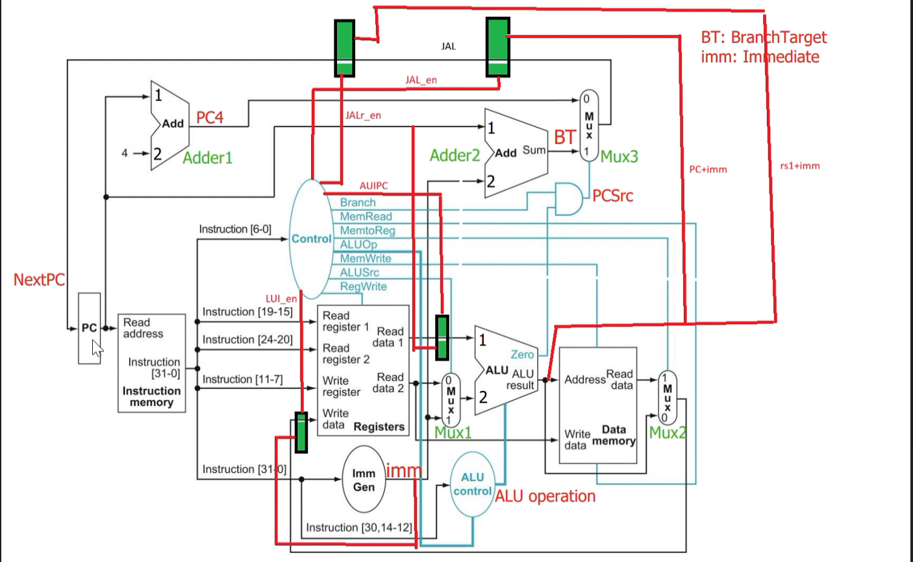
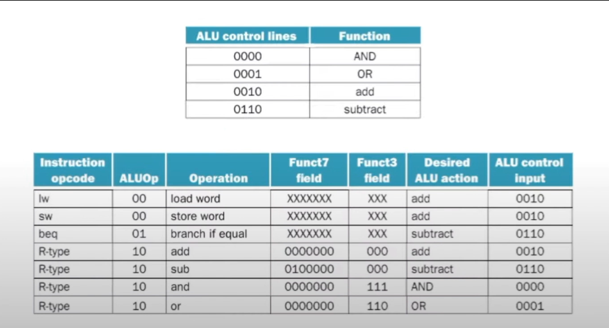
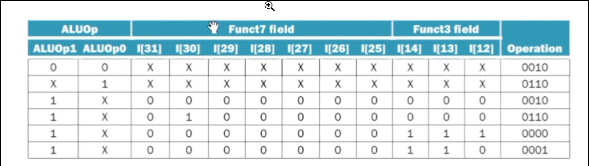

# RISC-V Single-Cycle CPU with RV32I Instruction Set

This repository contains a compact single-cycle RISC-V processor designed around the RV32I integer instruction set. The design focuses on the fundamental building blocks of a CPU datapath: fetching instructions, decoding control signals, reading and writing registers, generating immediates, performing ALU operations, and branching based on conditions.

The project is implemented in Verilog and is intended for learning digital design, CPU architecture, and hardware description modeling.

## Project Goal

The objective of this project is to model a simple CPU that can execute instructions in a single clock cycle by combining the following functional units:

- Program Counter (PC)
- Instruction Memory
- Register File
- Immediate Generator
- Control Unit
- ALU and ALU Control
- Branch Logic
- Data Memory
- Multiplexers for datapath selection

The result is a minimal but conceptually accurate single-cycle datapath that illustrates the architecture of a basic RISC-V processor.

## High-Level Architecture

The full processor datapath is represented in the block diagram below.

This diagram shows how the instruction memory, control unit, register file, ALU, branch unit, and memory blocks are interconnected. The flow is as follows:

1. The PC sends the current instruction address to instruction memory.
2. Instruction memory fetches the instruction word.
3. The instruction is decoded to identify the opcode and fields such as rs1, rs2, rd, funct3, and funct7.
4. The control unit generates the selection and enable signals for the datapath.
5. The immediate generator extracts the correct immediate value depending on the instruction type.
6. The register file reads the operands, and the ALU performs the required operation.
7. Branch and jump conditions decide the next PC value.
8. Data memory is accessed when the instruction is a load/store operation.

---

## What This CPU Supports

This project implements the core ideas behind the RV32I subset, including:

- Integer register-register operations
- Immediate arithmetic/logical operations
- Load and store instructions
- Branch instructions
- Jump and link operations
- Upper-immediate instructions such as LUI and AUIPC

The design is intentionally modular, which makes it easy to understand and extend.

---

## Key Modules and Their Roles

### 1. Program Counter
File: `program_counter.v`

The program counter tracks the current instruction address and updates it every clock cycle.

- Input: current PC value and reset signal
- Output: next PC state
- Behavior: resets to zero on reset, otherwise updates to the input PC value

This module is the central element that controls instruction sequencing.

### 2. Instruction Memory
File: `instruction_mem.v`

Instruction memory stores the machine instructions as a 32-bit word array.

- The address is word-aligned using `read_address >> 2`
- The instruction is fetched from memory and passed to the decoding logic

This module is essential for fetching the current instruction at each PC value.

### 3. Register File
File: `reg_file.v`

The register file is a bank of 32 registers used for source and destination operands.

- Reads `rs1` and `rs2`
- Writes to `rd` when `reg_write` is asserted
- Resets the registers during initialization

This provides the instruction operand values used by the ALU and datapath.

### 4. Immediate Generator
File: `imm_gen.v`

This module extracts the immediate value from the instruction based on its format.

Supported categories include:

- I-type immediate values
- S-type store immediates
- B-type branch immediates
- U-type immediates for LUI and AUIPC
- J-type immediates for JAL and JALR

This logic is critical because different instruction formats encode immediate values in different bit positions.

### 5. Control Unit
File: `control_unit.v`

The control unit decodes the opcode and produces the datapath control signals.

It determines:

- whether a branch is taken
- whether memory is read or written
- whether data is sent from memory or ALU to the register file
- whether ALU input uses immediate or register value
- whether a register write occurs
- which instruction type is being executed

This acts as the brain of the processor for instruction interpretation.

### 6. ALU Unit
File: `ALU_unit.v`

The ALU executes the arithmetic and logical operations required by the instruction stream.

Supported operations in this implementation include:

- AND
- OR
- ADD
- SUBTRACT

The `zero` signal is used to signal equality conditions for branch instructions.

### 7. ALU Control
File: `ALU_control.v`

The ALU control logic maps the instruction’s opcode, funct7, and funct3 fields into the correct ALU operation.

This logic bridges the gap between the instruction encoding and the hardware-level ALU inputs.

The first image explains the ALU control lines and their mapping to functions such as AND, OR, add, and subtract. It shows the operation table used by the control logic.

The second image illustrates a compact ALU control truth table, where the control signals depend on ALUOp, funct7, and funct3. This is the exact type of logic used to distinguish between add, subtract, AND, and OR operations.

---

## Datapath Flow in Simple Terms

The processor operates in a classic single-cycle manner:

1. Fetch the instruction from memory.
2. Decode its opcode and fields.
3. Read operands from the register file.
4. Form immediate values.
5. Run the ALU operation.
6. Compute branch target or next PC.
7. Write results back to registers or memory.
8. Repeat for the next instruction.

This is why the design is called a single-cycle CPU: all major steps occur within one clock cycle for each instruction, instead of being split across pipeline stages.

---

## Control and ALU Operation Details

The ALU control logic follows the pattern of the RISC-V instruction format.

For example:

- `LOAD` and `STORE` instructions use ALU add
- `BEQ` uses subtraction to test equality
- R-type `ADD` uses ALU add
- R-type `SUB` uses ALU subtract
- R-type `AND` uses bitwise AND
- R-type `OR` uses bitwise OR

The design uses the following decision approach:

| Instruction type | ALUOp | funct7 | funct3 | ALU action | ALU control |
| --- | --- | --- | --- | --- | --- |
| Load/Store | 00 | X | X | add | 0010 |
| Branch | 01 | X | X | subtract | 0110 |
| R-type add | 10 | 0000000 | 000 | add | 0010 |
| R-type sub | 10 | 0100000 | 000 | subtract | 0110 |
| R-type and | 10 | 0000000 | 111 | AND | 0000 |
| R-type or | 10 | 0000000 | 110 | OR | 0001 |

This behavior is the heart of the CPU’s instruction execution.

---

## Branching and Jump Handling

The datapath includes logic to handle:

- branch addresses
- jump addresses
- PC selection between sequential execution and target execution

The processor computes both the ordinary PC+4 path and the branch/jump target path, then selects the correct value using control signals.

This ensures the CPU can:

- continue sequentially for normal instructions
- jump to a target address for JAL/JALR
- branch to a target when a condition is true

---

## Data Memory and Write Back

The design also includes a data memory block for load/store instructions.

- Memory read output is sent to the write-back mux
- ALU result can also be written back to the register file
- A final mux selects the correct source for register writes

This allows instructions such as `lw`, `sw`, and arithmetic operations to work correctly in the same single-cycle datapath.

---

## File Structure

This repository contains the essential Verilog modules of the processor:

- `top.v` — top-level design integrating the CPU datapath
- `control_unit.v` — instruction decoding and control signal generation
- `ALU_unit.v` — arithmetic and logical computation
- `ALU_control.v` — ALU operation selection
- `program_counter.v` — program counter register
- `instruction_mem.v` — instruction fetch memory
- `reg_file.v` — register storage
- `imm_gen.v` — immediate extraction
- `data_mem.v` — memory for load/store operations
- `branch_adder.v` — branch target address calculation
- `PC_inc.v` — PC increment logic
- `mux.v` — generic multiplexing module
- `gate_logic.v` — branch gating logic

---

## How to Use This Project

1. Open the project in a Verilog-capable environment such as Vivado.
2. Add these modules to a design project.
3. Instantiate `top.v` as the system-level module.
4. Drive the `clk` and `rst` inputs with a testbench.
5. Simulate the CPU behavior for sample instructions.
6. Extend the datapath with additional instructions as needed.

A simple testbench can:

- initialize the clock and reset
- set an initial program counter value
- fetch instructions from `instruction_mem.v`
- validate register writes and immediate generation
- check branch behavior and ALU output

---

## Educational Value

This project is a valuable learning resource for understanding:

- CPU datapath design
- instruction decoding
- register file operations
- immediate format handling
- ALU control logic
- branch target generation
- single-cycle execution model

It is a good starting point for students and designers who want to learn how a simple processor is structured in hardware.

---

## Summary

This repository presents a small but complete educational RISC-V single-cycle processor based on RV32I principles. It is not a production-grade CPU, but it is a strong hardware design example for understanding the relationship between instructions, control logic, datapath selection, and execution in a real processor.

The design is deliberately modular and easy to extend, making it a practical foundation for future work in pipelining, hazard handling, instruction decode expansion, and FPGA implementation.

---

## License

This project is intended for educational and learning purposes.
